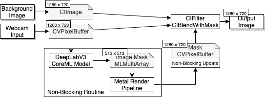
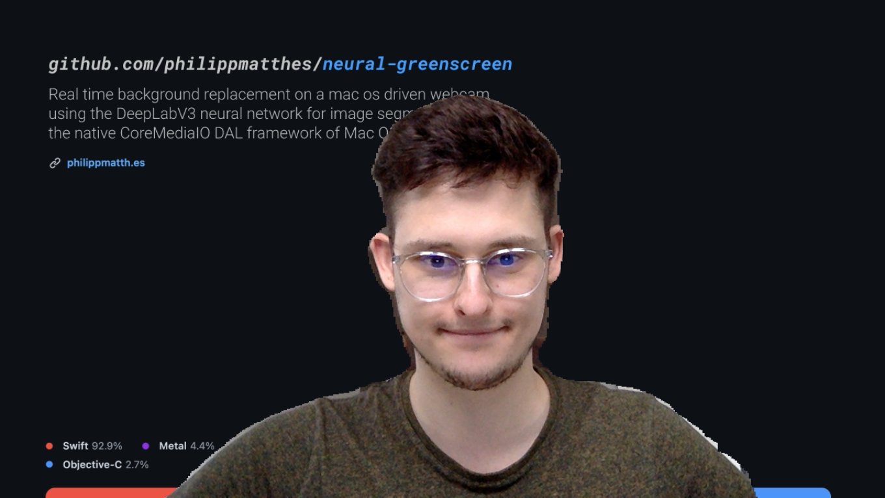

# Neural Greenscreen

Realtime background removal with neural networks on mac os, providing a virtual camera, which can be accessed by third party applications. ➡️ [Read the Medium article](https://philippmatthes.medium.com/how-to-create-a-system-wide-plugin-for-mac-os-which-removes-the-background-of-the-webcam-2cb88a94dc7b)

Based on [seanchas116/SimpleDALPlugin](https://github.com/seanchas116/SimpleDALPlugin) and [johnboiles/coremediaio-dal-minimal-example](https://github.com/johnboiles/coremediaio-dal-minimal-example).

# Prerequesites

- A system running mac os with a builtin webcam
- Xcode

# Setup

- Check your webcam dimensions and change the code (and the background) if your webcam has a higher resolution than 1280 x 720
- Build neural-greenscreen in Xcode
- Copy `neuralGreenscreenMain.plugin` into `/Library/CoreMediaIO/Plug-Ins/DAL`
- Open app that uses your webcam and choose Neural Greenscreen as camera input

You should see the background being replaced.

# Troubleshooting

DAL plugins access very low level mac os interfaces. It could be that the plugin is not detected or crashes depending on your system or app. If you find a problem, report it so that we can fix it. Here is a recommended workflow:

- Check your logs (using the mac os console, search for `neural`)
- Open an issue explaining your problem

# License

This project is licensed under `MIT License`.
