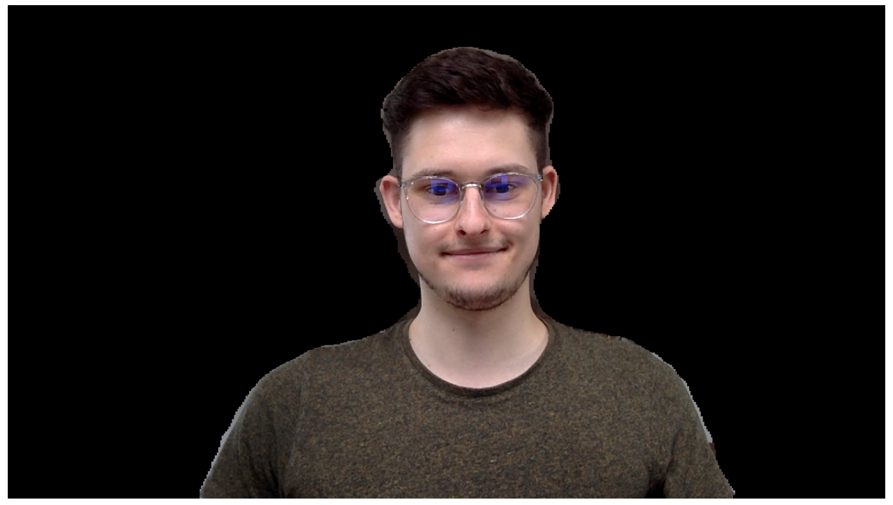

# Neural Greenscreen

Realtime background removal with neural networks on mac os, providing a virtual camera, which can be accessed by third party applications.

Based on [seanchas116/SimpleDALPlugin](https://github.com/seanchas116/SimpleDALPlugin) and [johnboiles/coremediaio-dal-minimal-example](https://github.com/johnboiles/coremediaio-dal-minimal-example).

# Prerequesites

- a system running mac os with a builtin webcam
- node.js, yarn (recommended) or npm
- openssl
- xcode

# Setup

- Drop the background you want to use as `background.jpg` in the repo directory.

- Build neural-greenscreen in Xcode
- Copy neuralGreenscreenMain.plugin into `/Library/CoreMediaIO/Plug-Ins/DAL`
- Open Webcam-using app and choose Neural Greenscreen as camera input

You will see your webcam but without any effect, the effect is computed by Tensorflow.js will be running on a separate node.js server. Firstly, we need to set up a locally signed SSL certificate to work with most apps ATS (App Transport Security):

- From the repo directory, run `./create-root-cert.sh` and enter desired credentials for your signing certificate.
- Import `rootCA.pem` into your keychain and trust the certificate locally, like in this screenshot:

- With this signed certificate, create a new (locally trusted) SSL certificate, by running `./create-server-cert.sh` 

Now we have a locally trusted SSL certificate, and we can run our node.js server on `https://localhost:9000` instead of  `http://localhost:9000`, which means that all Apps should now accept the local requests, which our stream makes to the local node.js server to obtain the image mask created by the Tensorflow.js BodyPix Neural Network.

- Run `yarn` to install all required node packages
- Run `yarn start` to fire up the node server

You should now see the mask rendered into your stream. If not, carefully reread the steps above and retry from the beginning. If the problem persists, feel free to file an issue or enqueue a pull request.
